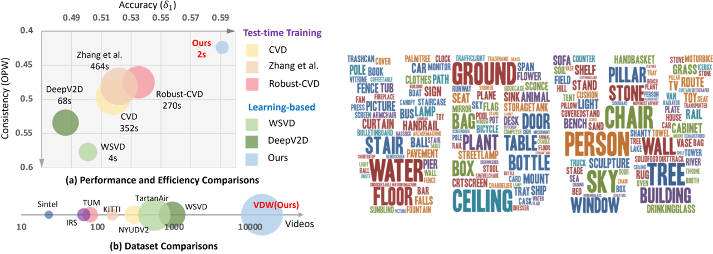

# VDW_Dataset_Toolkits 🚀🚀🚀

🎉🎉🎉 **Welcome to the VDW Dataset Toolkits!** 🎉🎉🎉  

**This repo contains the official generation code of Video Depth in the Wild (VDW) dataset.**

**The toolkits also serve as a comprehensive codebase to generate disparity from stereo videos.**

The VDW dataset is proposed by ICCV 2023 paper "Neural Video Depth Stabilizer" ([NVDS repo](https://github.com/RaymondWang987/NVDS))

Authors: [Yiran Wang](https://scholar.google.com.hk/citations?hl=zh-CN&user=p_RnaI8AAAAJ)<sup>1</sup>,
[Min Shi](https://www.semanticscholar.org/author/Min-Shi/1516268415)<sup>1</sup>,
[Jiaqi Li](https://scholar.google.com/citations?hl=zh-CN&user=i-2ghuYAAAAJ)<sup>1</sup>,
[Zihao Huang](https://orcid.org/0000-0002-8804-191X)<sup>1</sup>,
[Zhiguo Cao](http://english.aia.hust.edu.cn/info/1085/1528.htm)<sup>1</sup>,
[Jianming Zhang](https://jimmie33.github.io/)<sup>2</sup>,
[Ke Xian](https://sites.google.com/site/kexian1991/)<sup>3*</sup>, 
[Guosheng Lin](https://guosheng.github.io/)<sup>3</sup>


Institutes: <sup>1</sup>Huazhong University of Science and Technology, <sup>2</sup>Adobe Research, <sup>3</sup>Nanyang Technological University

### [Project Page](https://raymondwang987.github.io/NVDS/) | [NVDS](https://github.com/RaymondWang987/NVDS) | [Paper](https://openaccess.thecvf.com/content/ICCV2023/html/Wang_Neural_Video_Depth_Stabilizer_ICCV_2023_paper.html) | [VDW Dataset](https://raymondwang987.github.io/VDW/)

## 🌼 VDW Dataset
<p align="center">

</p>

+ **Dataset Description.** Previous video depth datasets are limited in both diversity and volume. To compensate for the data shortage and boost the performance of learning-based video depth models, we elaborate a large-scale natural-scene dataset, Video Depth in the Wild (VDW). To the best of our knowledge, our VDW dataset is currently the largest video depth dataset with the most diverse video scenes. We collect stereo videos from diverse data sources. The VDW test set is with 90 videos and 12622 frames, while the VDW training set contains 14203 videos with over 2 million frames (8TB on hard drive). We also provide a VDW demo set with two sequences. Users could leverage the VDW official toolkits and demo sequences to learn about our data processing pipeline.

 + **Releasing Policy.** We have released the VDW dataset under strict conditions. We must ensure that the releasing won’t violate any copyright requirements. **To this end, we will not release any video frames or the derived data in public.** Instead, we provide meta data and detailed toolkits, which can be used to reproduce VDW or generate your own data. All the meta data and toolkits are licensed under [CC BY-NC-SA 4.0](https://github.com/RaymondWang987/VDW_Dataset_Toolkits/blob/main/LICENSE), which can only be used for academic and research purposes. Refer to the [VDW official website](https://raymondwang987.github.io/VDW/) for more information.

## 🔨 Installation
+ **Environments.** Two conda envs are required: `VDW` and `mask2former`. The VDW env is based on `python=3.6.13` and `pytorch==1.7.1`. Refer to the `requirements.txt` (packages retrieved by pip freeze) for details. **We install the basic packages,  [GMFlow](https://github.com/haofeixu/gmflow), and [SegFormer](https://github.com/NVlabs/SegFormer) in the VDW env, while create another mask2former env for [Mask2Former](https://github.com/facebookresearch/Mask2Former).**
  ```
  conda create -n VDW python=3.6.13
  conda activate VDW
  conda install pytorch==1.7.1 torchvision==0.8.2 cudatoolkit=11.1 -c pytorch -c conda-forge
  pip install -r requirements.txt
  ```
  ```
  # Refer to the installation of Mask2Former.
  conda create -n mask2former python=3.8.13
  conda activate mask2former
  conda install pytorch==1.9.0 torchvision==0.10.0 cudatoolkit=11.1 -c pytorch -c conda-forge
  pip install numpy imageio opencv-python scipy tensorboard timm scikit-image tqdm glob h5py
  ```
+ **Installation of GMflow, Mask2Former, and SegFormer.** We utilize state-of-the-art optical flow model [GMFlow](https://arxiv.org/abs/2111.13680) to generate disparity. The semantic segmentation models Mask2Former and SegFormer are utilized to conduct sky segmentation (infinitely far, i.e., zero disparity). Please refer to [GMFlow](https://github.com/haofeixu/gmflow), [SegFormer](https://github.com/NVlabs/SegFormer) (the two in VDW env), and [Mask2Former](https://github.com/facebookresearch/Mask2Former) (in mask2former env) for installation. 

+ **MMCV and MMseg.** The [SegFormer](https://github.com/NVlabs/SegFormer) also relies on MMSegmentation and MMCV. **we suggest you to install `mmcv-full==1.x.x`**, because some API or functions are removed in `mmcv-full==2.x.x`. Please refer to [MMSegmentation-v0.11.0](https://github.com/open-mmlab/mmsegmentation/tree/v0.11.0) and their [official document](https://mmsegmentation.readthedocs.io/en/latest/get_started.html) for detailed installation instructions step by step. **The key is to match the version of mmcv-full and mmsegmentation with the version of cuda and pytorch on your server.** For instance, I have `CUDA 11.1` and `PyTorch 1.9.0` on my server, thus `mmcv-full 1.3.x` and `mmseg 0.11.0` (as in our installation instructions) are compatible with my environment (confirmed by [mmcv-full 1.3.x](https://mmcv.readthedocs.io/zh_CN/v1.3.13/get_started/installation.html)). You should check the matching version of your own server on the official documents of [mmcv-full](https://mmcv.readthedocs.io/en/latest/) and [mmseg](https://mmsegmentation.readthedocs.io/en/latest/). You can choose different versions in their documents and check the version matching relations. By reading and following the detailed mmcv-full and mmseg documents, the installation seems to be easy. You can also refer to [NVDS Issue #1](https://github.com/RaymondWang987/NVDS/issues/1) and the [SegFormer](https://github.com/NVlabs/SegFormer) for some discussions.

  
## ⚡ Data Generation with VDW Demo Set
+ **Prerequisite.** We splice ​​two sequences into a demo video to illustrate on the video scene segmentation. Only the sequence with consecutive camera motion can be considered as one sample in the dataset. We use [PySceneDetect](https://github.com/Breakthrough/PySceneDetect) to split the raw video `./VDW_Demo_Dataset/raw_video/rgbdemo.mp4` into sequences.
  ```
  conda activate VDW
  pip install scenedetect[opencv] --upgrade
  cd VDW_Dataset_Toolkits
  scenedetect -i ./VDW_Demo_Dataset/raw_video/rgbdemo.mp4 -o ./VDW_Demo_Dataset/scenedetect/ split-video detect-adaptive
  ```
  The two segmented sequences will be saved in `./VDW_Demo_Dataset/scenedetect/`. To run the toolkits, you should rename the sequences to `000001.mp4`, `000002.mp4`, etc. For reproducing the data, we provide the time stamps in our [meta data](https://raymondwang987.github.io/VDW/). Thus, [FFmpeg](https://ffmpeg.org/) can also be used to split the video with the time stamps.
  ```
  ffmpeg -i ./VDW_Demo_Dataset/raw_video/rgbdemo.mp4 -ss t0 -t t1 ./VDW_Demo_Dataset/scenedetect/000001.mp4
  ffmpeg -i ./VDW_Demo_Dataset/raw_video/rgbdemo.mp4 -ss t1 -t t2 ./VDW_Demo_Dataset/scenedetect/000002.mp4
  ```
  Meanwhile, you should also download the [segformer.b5.640x640.ade.160k.pth](https://connecthkuhk-my.sharepoint.com/personal/xieenze_connect_hku_hk/_layouts/15/onedrive.aspx?id=%2Fpersonal%2Fxieenze%5Fconnect%5Fhku%5Fhk%2FDocuments%2Fsegformer%2Ftrained%5Fmodels&ga=1) and [model_final_6b4a3a.pkl (Mask2Former)](https://dl.fbaipublicfiles.com/maskformer/mask2former/ade20k/semantic/maskformer2_swin_large_IN21k_384_bs16_160k_res640/model_final_6b4a3a.pkl), putting them into the `./sky/SegFormer-master/checkpoints/` and `./sky/Mask2Former/checkpoints/` folders respectively.

+ **Processing Scripts.** Remember to modify the `template_conda.sh` with your own conda patch. After that, you can generate the processing sh script `demo.sh` for the demo sequences.
  ```
  python ./writesh/writesh.py --start 1 --end 2 --cuda 0 --shname ./demo.sh --fromdir ./VDW_Demo_Dataset/scenedetect/ --todir ./VDW_Demo_Dataset/processed_dataset/ --cut_black_bar False
  ```
  If you are running on more videos, you can simply adjust `--start 1 --end 2` to start and end numbers of your sequences. If your raw video contain black bars or subtitles, set `--cut_black_bar True` to remove those area. In our demo code, we simply center-crop the frames into $1880\times 800$. Change the area in `./process/cut_edge.py` if it does not match your videos. Overall, the `./writesh/writesh.py` can: (1) generate the running script; (2) make necessary folders in `--todir`, which will save your processed dataset; (3) copy the sequences from `--fromdir` to the `--todir` directory. We showcase sequence `000001` of `./VDW_Demo_Dataset/processed_dataset/` as follows:
  ```
  ./processed_dataset/000001
  └─── rgblr                      # Rgb frames for GMFlow
  └─── left, right                # Left- and right-view frames
  └─── left_flip, right_flip      # Horizontally-flipped frames
  └─── left_gt, right_gt          # Disparity ground truth
  └─── flow                       # Optical flow & consistency check mask
  └─── left_seg, right_seg        # Visualization of semantic segmentation
  └─── l1, l2, l3, l4             # Left-view sky masks for voting
  └─── r1, r2, r3, r4             # Right-view sky masks for voting
  └─── left_sky, right_sky        # Sky masks after ensemble and voting
  └─── rgb.mp4                    # Original stereo video sequence
  └─── rgbl.mp4, rgbr.mp4                         # Video sequence of left and right view
  └─── leftrgb.avi, rightrgb.avi                  # Left and Right sequence for Mask2Former
  └─── leftrgb_flip.avi, rightrgb_flip.avi        # Fliped sequence for Mask2Former
  └─── range_avg.txt              # Data range of horizontal disparity
  └─── shift_scale_lr.txt         # Scale and shift of horizontal disparity
  └─── ver_ratio.txt              # Ratios of pixels with vertical disparity over 2 pixels
  ```

+ **Data Generation.** The data generation process can start by running the script. You can simply adopt multiple scripts on different GPUs (specify `--cuda` for the `./writesh/writesh.py`) to generate large-scale data parallelly.
  ```
  bash demo.sh
  ```
  The `demo.sh` contains the generation process of all demo sequences. With sequence `000001` as an example, the data processing pipeline is presented as follows. For our `./gmflow-main/`, `./sky/Mask2Former`, and `./sky/SegFormer-master/` folders, we conduct modifications based on their official repos to leverage their models in generating VDW. The disparity of final voted sky regions are set to zero.
  ```
  # Pre-processing
  conda deactivate
  conda activate VDW
  ffmpeg -i ./VDW_Demo_Dataset/processed_dataset/000001/rgb.mp4 -vf "stereo3d=sbsl:ml,scale=iw*2:ih" -x264-params "crf=24" -c:a copy -y ./VDW_Demo_Dataset/processed_dataset/000001/rgbl.mp4
  ffmpeg -i ./VDW_Demo_Dataset/processed_dataset/000001/rgb.mp4 -vf "stereo3d=sbsl:mr,scale=iw*2:ih" -x264-params "crf=24" -c:a copy -y ./VDW_Demo_Dataset/processed_dataset/000001/rgbr.mp4
  python ./process/extract_frames.py --base_dir ./VDW_Demo_Dataset/processed_dataset/000001/
  python ./process/readrgb.py --base_dir ./VDW_Demo_Dataset/processed_dataset/000001/
  python ./process/fliprgb.py --base_dir ./VDW_Demo_Dataset/processed_dataset/000001/
  python ./process/lrf2video.py --base_dir ./VDW_Demo_Dataset/processed_dataset/000001/

  # Sky segmentation (with SegFormer)
  python ./sky/SegFormer-master/demo/image_demo.py ./sky/SegFormer-master/local_configs/segformer/B5/segformer.b5.640x640.ade.160k.py ./sky/SegFormer-master/checkpoints/segformer.b5.640x640.ade.160k.pth --device cuda:0 --base_dir ./VDW_Demo_Dataset/processed_dataset/000001/

  # Sky segmentation (with Mask2Former)
  conda deactivate
  conda activate mask2former
  CUDA_VISIBLE_DEVICES=0 python ./sky/Mask2Former/demo/demo.py --config-file ./sky/Mask2Former/configs/ade20k/semantic-segmentation/swin/maskformer2_swin_large_IN21k_384_bs16_160k_res640.yaml --video-input ./VDW_Demo_Dataset/processed_dataset/000001/leftrgb.avi --base_dir ./VDW_Demo_Dataset/processed_dataset/000001/l3/ --mode noflip --opts MODEL.WEIGHTS ./sky/Mask2Former/checkpoints/model_final_6b4a3a.pkl
  CUDA_VISIBLE_DEVICES=0 python ./sky/Mask2Former/demo/demo.py --config-file ./sky/Mask2Former/configs/ade20k/semantic-segmentation/swin/maskformer2_swin_large_IN21k_384_bs16_160k_res640.yaml --video-input ./VDW_Demo_Dataset/processed_dataset/000001/leftrgb_flip.avi --base_dir ./VDW_Demo_Dataset/processed_dataset/000001/l4/ --mode noflip --opts MODEL.WEIGHTS ./sky/Mask2Former/checkpoints/model_final_6b4a3a.pkl
  CUDA_VISIBLE_DEVICES=0 python ./sky/Mask2Former/demo/demo.py --config-file ./sky/Mask2Former/configs/ade20k/semantic-segmentation/swin/maskformer2_swin_large_IN21k_384_bs16_160k_res640.yaml --video-input ./VDW_Demo_Dataset/processed_dataset/000001/rightrgb.avi --base_dir ./VDW_Demo_Dataset/processed_dataset/000001/r3/ --mode noflip --opts MODEL.WEIGHTS ./sky/Mask2Former/checkpoints/model_final_6b4a3a.pkl
  CUDA_VISIBLE_DEVICES=0 python ./sky/Mask2Former/demo/demo.py --config-file ./sky/Mask2Former/configs/ade20k/semantic-segmentation/swin/maskformer2_swin_large_IN21k_384_bs16_160k_res640.yaml --video-input ./VDW_Demo_Dataset/processed_dataset/000001/rightrgb_flip.avi --base_dir ./VDW_Demo_Dataset/processed_dataset/000001/r4/ --mode noflip --opts MODEL.WEIGHTS ./sky/Mask2Former/checkpoints/model_final_6b4a3a.pkl

  # Sky ensemble and voting
  conda deactivate
  conda activate VDW
  python ./process/vote_sky.py --base_dir ./VDW_Demo_Dataset/processed_dataset/000001/
  python ./process/fill_hole.py --base_dir ./VDW_Demo_Dataset/processed_dataset/000001/

  # Disparity generation (with GMFlow)
  CUDA_VISIBLE_DEVICES=0 python ./gmflow-main/main_gray.py --batch_size 2 --inference_dir ./VDW_Demo_Dataset/processed_dataset/000001/rgblr/ --dir_paired_data  --output_path ./VDW_Demo_Dataset/processed_dataset/000001/flow/ --resume ./gmflow-main/pretrained/gmflow_sintel-0c07dcb3.pth -- pred_bidir_flow --fwd_bwd_consistency_check --base_dir ./VDW_Demo_Dataset/processed_dataset/000001/ --inference_size 720 1280
  ```

+ **Invalid Sample Filtering.** Having obtained the annotations, we further filter the videos that are not qualified for our dataset. According to optical flow and valid masks, samples with the following three conditions are removed:
  +  more than 30% of pixels in the consistency masks are invalid;
  +  more than 10% of pixels have vertical disparity larger than two pixels;
  +  the average range of horizontal disparity is less than 15 pixels.
  
  We utilize the saved `range_avg.txt`, `ver_ratio.txt` and the flow masks in `flow` folder to check all the sequences quantitatively. The unqualified sequences will be written to `--deletetxt` and deleted as follows. Besides, manually checking the quality of ground truth by visualization is necessary (many times needed). You can use `./check/checkgtvideos.py` to save video results (RGB, gt, and mask). 
  ```
  python ./check/checkvideos.py --start 1 --end 2 --base_dir ./VDW_Demo_Dataset/processed_dataset/ --deletetxt ./check/bad_demo.txt
  python ./check/deletebad.py --deletetxt ./check/bad_demo.txt
  ```
  
+ **Post-processing.** At last, save the flow mask as a valid mask of pixels for training. Several unnecessary intermediate results will also be deleted.
  ```
  python deletefile.py --start 1 --end 2 --base_dir ./VDW_Demo_Dataset/processed_dataset/
  python savemask.py --start 1 --end 2 --base_dir ./VDW_Demo_Dataset/processed_dataset/
  ```
  After all the progresses above, you can generate the disparity from stereo videos, not only to reproduce VDW dataset but also to make your own customized data. We provide the generated [VDW demo set](https://drive.google.com/drive/folders/1zY84BwSCSOH8WsHEwUBB4xgJ5eK7ie7N?usp=sharing) for all the users to validate their results. The final directory of the example sequnece `000001` will be:
  ```
  ./processed_dataset/000001
  └─── left, right                # Left- and right-view frames
  └─── left_gt, right_gt          # Disparity ground truth
  └─── left_mask, right_mask      # Valid mask for training
  └─── rgb.mp4                    # Original stereo video sequence
  └─── range_avg.txt              # Data range of horizontal disparity
  └─── shift_scale_lr.txt         # Scale and shift of horizontal disparity
  └─── ver_ratio.txt              # Ratios of pixels with vertical disparity over 2 pixels
  ```

## 🍭 Acknowledgement
We thank the authors for releasing [PyTorch](https://pytorch.org/), [MiDaS](https://github.com/intel-isl/MiDaS), [DPT](https://github.com/isl-org/DPT), [GMFlow](https://github.com/haofeixu/gmflow), [SegFormer](https://github.com/NVlabs/SegFormer), [VSS-CFFM](https://github.com/GuoleiSun/VSS-CFFM), [Mask2Former](https://github.com/facebookresearch/Mask2Former), [PySceneDetect](https://github.com/Breakthrough/PySceneDetect), and [FFmpeg](http://ffmpeg.org/). Thanks for their solid contributions and cheers to the community.

## 📧 Citation
```
@InProceedings{Wang_2023_ICCV,
    author    = {Wang, Yiran and Shi, Min and Li, Jiaqi and Huang, Zihao and Cao, Zhiguo and Zhang, Jianming and Xian, Ke and Lin, Guosheng},
    title     = {Neural Video Depth Stabilizer},
    booktitle = {Proceedings of the IEEE/CVF International Conference on Computer Vision (ICCV)},
    month     = {October},
    year      = {2023},
    pages     = {9466-9476}
}
```
  


